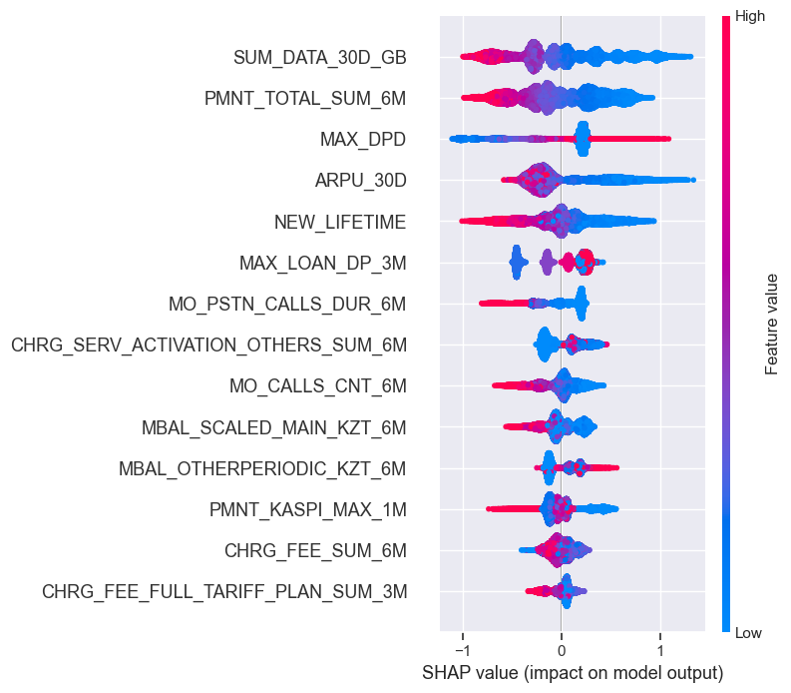
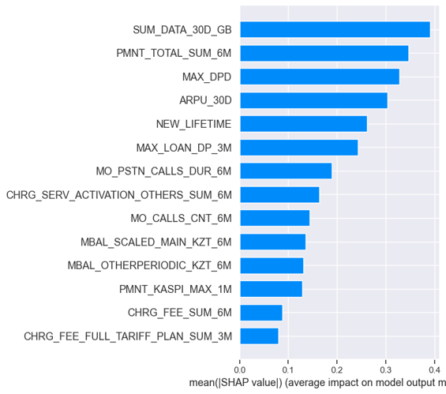
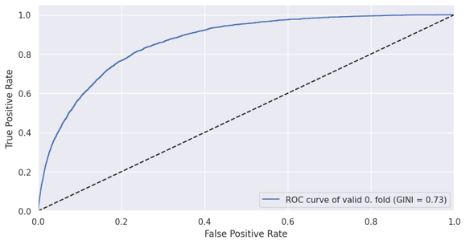
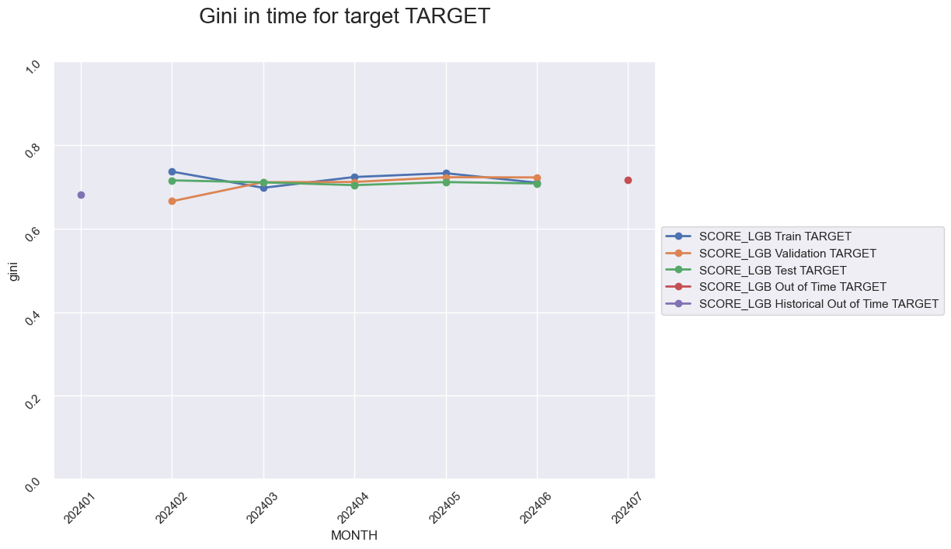
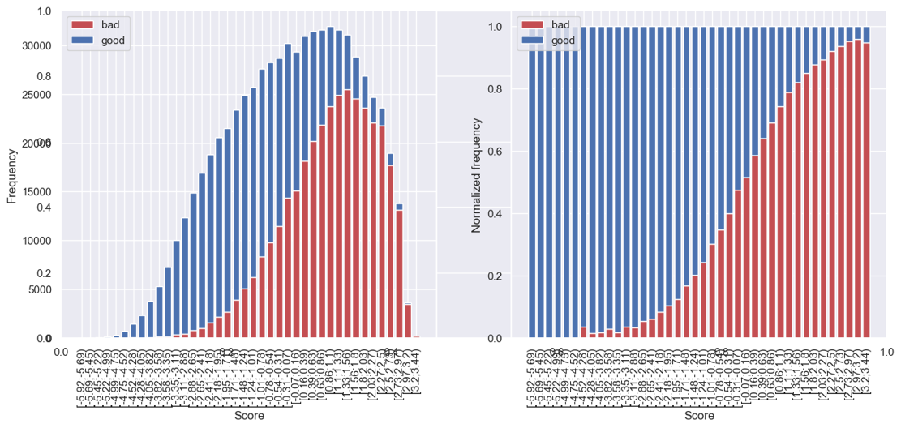
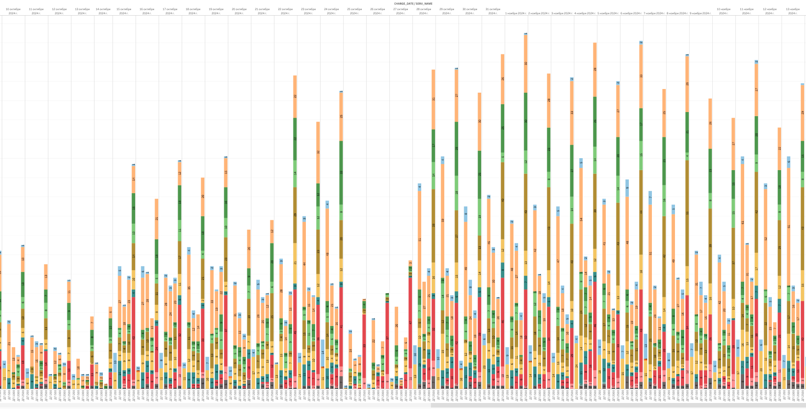
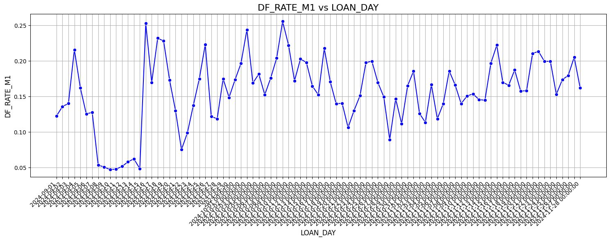
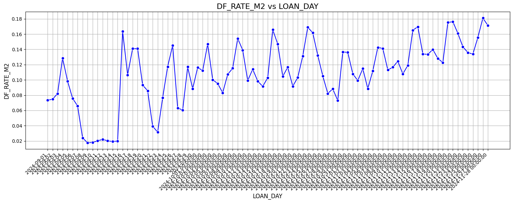

# DP MODEL 2024

The project includes scoring model for predicting defaults and the schema of product decision of the business process "Doveritilnie Platezhi". 

#### Project Status: [Active and Completed]

## Project Intro/Objective
The purpose of the project is to minimize the default cases in DP by creating a predictive model. Additionally, it is necessary to devide all population into several groups for different product offers. 

### Methods Used
* Data collection and preprocessing
* Inferential Statistics and target analysis
* Machine Learning algortithm LightGBM
* Data Visualization and data interpretation
* Model validation and Metrics
* 

### Technologies 
* Python
* P/L Sql
* Pandas, jupyter lab
* Git, Airflow, Kestra

## Glossary and description of keywords:

* Scores: Scores assigned by machine learning models to quantify the probability of an event, such as a customer defaulting.

* Score Deciles: Split the score distribution into ten equal parts to analyze the performance of the model in different segments. Deciles are sorted by decreasing scores, high probability, low score.

* GINI: The Gini coefficient is a metric used to evaluate the quality of a model. The closer GINI is to 1, the more accurately the model predicts the target event.

* Bins: Intervals into which variable values ​​are divided to analyze their impact on the target variable. For example, score values ​​can be grouped into bins for better interpretation.

* Features: Features or variables used in a machine learning model to predict the target event. Can be raw or aggregated data.

* LightGBM: A gradient boosting library for fast and efficient model training, especially on big data. Used for classification and regression problems.

* Data aggregation: The process of combining data across different time or other parameters, such as summing transactions over a month, to create a new feature for a model.

## Project Description
The process is first lauched in 2019-11-06. From that time there were several decision makers to minimize the defaults and to increase the profit.
In this project,  I used Ligthgbm machine learning algorithm to predict the defaults. The outcome of the model is probability score 0.0 - 1.0
By roc-auc it was defined the threshold 0.45.
But, the highest threshold is set to 0.7. If the abonent has P(default) > 0.7 then we do not offer any product.
Also, in this project, I created a feature **Risk Grade**  to segment abonents depending on their behavior and attitude to the product.

The following Risk grades are created: 

1. A+: (Existing and active abonents without default, who successfully took DP at least twice with maximum amounts of cash limit and have low default scores).
2. A: (Existing and active abonents without default, who successfully took DP at least once with maximum amounts  of cash limit and have low default scores).
3. B+: (Existing abonents without default, who successfully took DP at least once and have low default scores).
4. B: (Newer abonents without default, who successfully took DP at least once and have low default scores).
5. B-: (New abonents without default, who successfully took DP at least once and have high default scores).
6. C: (Old but active abonents without DP history, with very low default scores).
7. D: (New abonents without DP history with low default scores).
8. E: (Existing abonents with DP history and low default scores).
9. F: Fail, DP refusal
Separate interesting categories of remaining abonents:
R: (Old and new active abonents without default, who successfully took DP at least twice for the amount of 1000 KZT, but have high default scores).
R-: (Old and new active abonents without default, who successfully took DP at least once for the amount of 1000 KZT, but have high default scores).

Abonents who pass the default score, they are devided for 4 categories depending on their risk grades.

Now there are 4 nominals in this business process: 
- 1 - 200/500 KZT
- 2 - 1000 KZT
- 3 - 2000 KZT 
- 4 - 2500 KZT

## Technical features of Model

### Selected features

| |Feature name | Description | GINI+ |
|-|---------|-----------------| ----- |
|1 | ARPU_30D | Average Revenue Per User over the past 3 months | 0.637528 |
|2 |CHRG_FEE_FULL_TARIFF_PLAN_SUM_3M | Total charges collected from users with a full tariff plan (by main balances) - (aggregation for the last 3 months)  | 0.323532 |
|3 | CHRG_FEE_SUM_6M | Total charges (by main balances)  | 0.119657 |
|4 | CHRG_SERV_ACTIVATION_OTHERS_SUM_6M | Total charges upon activation of the service with the type 'Content' and 'Other VAS'  | 0.194294 |
|5 | MAX_DPD |  Maximum number of days overdue for the entire period (10.2023-2024-08) |0.975056|
|6 | MAX_LOAN_DP_3M | Maximum DP amount for the last 3 months  | 0.691492 |
|7 | MBAL_OTHERPERIODIC_KZT_6M | Total charges for other periodic services by main balances (real money)  |0.192234|
|8 | MBAL_SCALED_MAIN_KZT_6M |  Total charges for partial (daily, scaled) subscription fees for the tariff by main balances (real money) |0.098324|
|9 | MO_CALLS_CNT_6M |  Total number of sessions for outgoing calls - (aggregation for the last 6 months) |0.330475|
|10| MO_PSTN_CALLS_DUR_6M | Duration of outgoing calls ('GSM - PSTN')  |0.330475|
|11| NEW_LIFETIME | Abonent lifespan  |0.859527|
|12| PMNT_KASPI_MAX_1M |  Maximum payment amount for the payment type "Kaspi" |0.58839|
|13| PMNT_TOTAL_SUM_6M | Total amount of payments - (aggregation for the last 6 months)  |0.536443|

SHAP (SHapley Additive exPlanations) values indicate the contribution of each feature to the prediction made by the model.

*Feature Importance:
  The most important feature in the model is MAX_DAY_DIFF_6M, followed by PMNT_PROMISED_PMT_MAX_6M, CHRG_SERV_CONTENT_CNT_6M, and others. The higher up the feature on the Y-axis, the more significant its contribution to the model's prediction.*

*Impact on Predictions:
  The X-axis shows how much each feature's value pushes the model's prediction.
  Positive SHAP values (right) increase the prediction, while negative SHAP values (left) decrease it.*

*Feature Values:
  Red points represent higher feature values, and blue points represent lower feature values.
  For instance, high values of MAX_DAY_DIFF_6M (in red) lead to higher predictions, while low values (in blue) reduce the prediction.*

Below, you see the technical characteristics of the model.

Outcomes/Results of the model:

We took 20% of the total base and applied scores + filters to 10%, and only scores without filters to the remaining 10%.
The best result comes when we apply scores + filters. In filters, because we cut off those who were already in default and segment clients by risk grades (risk level)

Our task was to increase the number of connections. Were we able to achieve the result? - Yes.
Below is a screenshot of the graph that analysts prepared for us. We see that the number abonents increased except 3 days when we faced tehcnical issues with datamart.Those, 3 days we did provide 0 score for most people.

But with the growth of connections, we also slightly increased the default rate (the number of non-returnable DP up to 4 days). There are 2 main reasons for this:

* 1.1. Among the subscribers we refuse, there are those who still receive DP. It is necessary to correct the speed score verification system.

* 1.2. In the pilot sample, we began to approve large denominations of 2500, they stopped returning money on time. Also, most subscribers had a probability higher than 0.8. After observation, I immediately removed this segment.
Also, I disabled 10% of the sample where filters were not applied.

2.If you compare only the default of the pilot group with the previous period, a decrease is observed

Below is the default rate for the remaining populations

There is one observation: the default rate is unstable and exhibits periodicity. An increase in defaults is consistently observed on Thursdays and Fridays each week. This means that those who receive payday loans (PD) on these days fail to repay them on time.

I reviewed my scores and the number of available loan amounts over the period. We consistently provide scores, and this is not influenced by the number of connections, as the peak connections usually occur at the beginning of the week.

This might be related to the weekends: people take payday loans and then forget or postpone repayment due to the weekend.

My proposals:

* It is crucial to prioritize fixing the scoring check and preventing the approval of applications with a score of 0, as these cases account for 10% of all defaults. By preventing approvals with such scores, we can recover 10% of the funds lost due to defaults.
* Conduct an analysis of external factors, review different channels, and investigate potential system errors. Your expert opinion would also be valuable for this analysis.
* I propose continuing to develop the pilot process, gradually increasing the pilot pool: from 10% → 30% → 50%.
Based on the current data, my model demonstrates the best results in terms of metrics.

Contributer and owner: Zhalgas Zhiyenbekov
